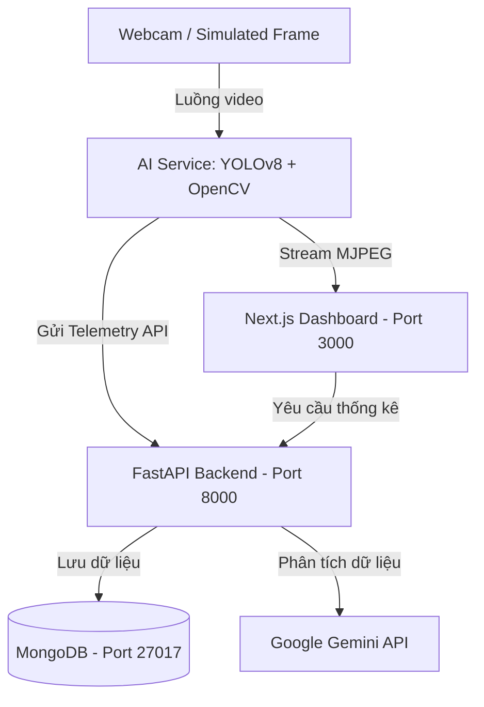

# 🏫 Edge AI Classroom Analytics (Dự án Học tập & Nghiên cứu)

Đây là dự án cá nhân được xây dựng trong quá trình học tập, tìm hiểu và thực hành về **Edge AI (Trí tuệ Nhân tạo tại Biên)**, **Docker Containerization**, và ứng dụng **Computer Vision** trong quản lý lớp học.

Dự án này giúp mình làm quen với cách tích hợp mô hình học máy (YOLOv8) chạy ở biên, thiết lập giao thức stream MJPEG trực tiếp, đồng bộ hóa telemetry thời gian thực về MongoDB và trực quan hóa dữ liệu lên giao diện Dashboard (Next.js).

---

## 🚀 Các Chức Năng Đang Tìm Hiểu & Triển Khai

1. **Phát hiện và đếm người (YOLOv8)**:
   - Thử nghiệm tích hợp mô hình **YOLOv8n (Nano)** siêu nhẹ để nhận diện học sinh trong khung hình.
   - Ghi nhận sĩ số và đẩy lịch sử về backend theo chu kỳ.

2. **Phân tích trạng thái học tập (Mô phỏng)**:
   - Nghiên cứu thuật toán phân loại hành vi tập trung (Focused, Neutral, Distracted) dựa trên pose/head-angle của người học.

3. **Trực quan hóa dữ liệu (Dashboard)**:
   - Hiển thị luồng video xử lý trực tiếp từ AI Service.
   - Vẽ biểu đồ theo dõi biến động sĩ số và phân bố tập trung theo thời gian thực.

4. **Tạo báo cáo tự động bằng LLM**:
   - Thử nghiệm gửi dữ liệu tổng hợp từ MongoDB qua **Gemini API** (`gemini-1.5-flash`) để tự động sinh báo cáo và nhận xét sư phạm dạng Markdown.

5. **Trình giả lập lớp học (Webcam Simulation)**:
   - Nhằm giải quyết khó khăn khi mount webcam vật lý từ máy chủ Windows/WSL2 vào Docker container, dự án tích hợp sẵn một bộ giả lập hoạt động của học sinh để tiện cho việc phát triển và debug logic hệ thống.

---

## 📐 Sơ Đồ Kiến Trúc Hệ Thống



---

## 🛠️ Các Công Nghệ Trải Nghiệm Trong Dự Án

* **Frontend**: Next.js (App Router), React, TailwindCSS, Recharts, Lucide Icons.
* **Backend API**: FastAPI (Python), Motor (Async MongoDB Driver).
* **AI Service**: Python, OpenCV, Ultralytics YOLOv8.
* **Database**: MongoDB.
* **Containerization**: Docker & Docker Compose.

---

## 📦 Hướng Dẫn Chạy Thử Nghiệm

### 1. Yêu cầu
* Đã cài đặt **Docker Desktop** trên máy.

### 2. Cấu hình khóa API (Tùy chọn)
Nếu muốn test thử tính năng phân tích báo cáo bằng Gemini, tạo file `.env` ở thư mục gốc:
```env
GEMINI_API_KEY=khoa_api_gemini_cua_ban
```
*(Nếu không điền, hệ thống sẽ tự sinh báo cáo giả lập có sẵn để demo).*

### 3. Khởi chạy hệ thống
Mở Terminal tại thư mục gốc và chạy lệnh:
```bash
docker-compose up --build
```

Sau khi các container chạy xong, truy cập các địa chỉ sau:
* **Giao diện Dashboard**: [http://localhost:3000](http://localhost:3000)
* **Backend API Docs (Swagger)**: [http://localhost:8000/docs](http://localhost:8000/docs)
* **AI Service Health**: [http://localhost:8001/health](http://localhost:8001/health)
