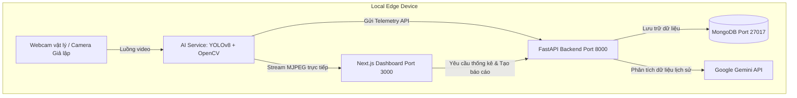

# 🏫 Smart Classroom Analytics - Edge AI Edition

Chào mừng bạn đến với **Smart Classroom Analytics - Edge AI Edition**! Đây là một dự án demo hoàn chỉnh, thiết kế chuyên nghiệp nhằm mô phỏng và giới thiệu các khái niệm cốt lõi của **Edge AI (Trí tuệ Nhân tạo tại Biên)**, **Docker Containerization**, **MongoDB** và tích hợp **Generative AI (Gemini API)** trong quản lý và cải tiến giáo dục.

Dự án này được tối ưu hóa chạy hoàn toàn cục bộ thông qua Docker Compose, cho phép khởi chạy ngay tức thì mà không cần bất kỳ cài đặt phần cứng hay cấu hình camera phức tạp nào nhờ chế độ **Webcam Simulation Fallback** cực kỳ thông minh.

---

## 🚀 Tính Năng Chính

1. **Student Counter (Đếm sinh viên trực tiếp)**:
   - Sử dụng mô hình **YOLOv8n (Nano)** siêu nhẹ để phát hiện người trong thời gian thực.
   - Thống kê sĩ số lớp học hiện có và tự động ghi nhận nhật ký vào MongoDB.

2. **Focus Analytics (Phân tích tập trung)**:
   - Đánh giá trạng thái chú ý của sinh viên dựa trên tư thế đầu/góc nhìn camera.
   - Phân loại thành 3 mức độ: **🟢 Focused (Tập trung)**, **🟡 Neutral (Bình thường)**, **🔴 Distracted (Phân tâm)**.
   - Tính toán Chỉ số Tập trung (Focus Score) theo thời gian thực.

3. **Attendance Analytics (Phân tích chuyên cần)**:
   - Ghi nhận lịch sử chuyên cần theo chu kỳ (mỗi 5 giây ở biên, gom nhóm theo buổi học).
   - Biểu diễn biểu đồ thống kê trực quan (Recharts Line & Area Chart) về biến động số lượng học sinh.

4. **AI Classroom Report (Báo cáo sư phạm tự động)**:
   - Đồng bộ dữ liệu lịch sử từ MongoDB và gửi yêu cầu phân tích tới **Gemini API**.
   - Gemini sinh báo cáo dạng Markdown chuyên nghiệp bằng tiếng Việt, đưa ra các nhận xét và khuyến nghị sư phạm thiết thực cho Giảng viên.
   - Tự động fallback sang cấu trúc báo cáo định sẵn siêu đẹp nếu chưa cấu hình Gemini API Key.

5. **Premium Dark Dashboard**:
   - Giao diện Admin tối tân, phản hồi nhanh (Responsive), mang phong cách Dark Mode chuyên nghiệp.
   - Tích hợp khung phát video MJPEG trực tiếp từ AI Service và các widget thống kê động.

---

## 📐 Kiến Trúc Hệ Thống



---

## 🛠️ Công Nghệ Sử Dụng

* **Frontend**: Next.js 14 (App Router), TypeScript, TailwindCSS, Recharts, Axios, Lucide Icons.
* **Backend API**: FastAPI (Python), Motor (Async MongoDB Driver), Pydantic v2.
* **AI Service**: Python, OpenCV Headless, Ultralytics YOLOv8, HTTPX.
* **Database**: MongoDB 6.0.
* **Containerization**: Docker & Docker Compose.
* **Generative AI**: Google Gemini API (`gemini-1.5-flash`).

---

## 🔌 Chế Độ Webcam Simulation Fallback (Cực kỳ quan trọng)

Khi chạy ứng dụng trong môi trường Docker trên Windows/WSL2, việc kết nối trực tiếp đến webcam vật lý (`cv2.VideoCapture(0)`) qua USB thường thất bại do hạn chế về driver của WSL2 (yêu cầu cài đặt usbipd rất phức tạp). 

Để giải quyết triệt để vấn đề này và đảm bảo demo chạy **out-of-the-box thành công 100%**:
- **AI Service** sẽ tự động quét camera vật lý trên máy chủ.
- Nếu không tìm thấy camera, hệ thống sẽ tự động kích hoạt **Chế độ Giả lập Sư phạm**.
- Chế độ giả lập sẽ vẽ một mô hình phòng học đồ họa 2.5D cực đẹp với các hàng ghế, học sinh có chuyển động vi mô (nháy mắt, chuyển hướng đầu, thở) và gán nhãn khung YOLOv8 (với độ chính xác thay đổi nhẹ) cùng chỉ báo trạng thái Focused/Neutral/Distracted.
- Nhờ vậy, luồng stream video hiển thị trên Dashboard vẫn sống động, trực quan và dữ liệu thống kê được đẩy liên tục vào MongoDB y như một hệ thống camera thật!

---

## 📦 Hướng Dẫn Cài Đặt và Khởi Chạy

### 1. Yêu cầu hệ thống
* Đã cài đặt **Docker Desktop** (hoặc Docker Engine & Docker Compose trên Linux/macOS).
* Kết nối Internet để Docker tải các image cơ sở và YOLOv8 pre-download weights.

### 2. Cấu hình môi trường (Tùy chọn)
Nếu bạn muốn sử dụng tính năng sinh báo cáo từ AI thực tế, hãy tạo file `.env` tại thư mục gốc của dự án và nhập API Key của bạn (nhận miễn phí tại [Google AI Studio](https://aistudio.google.com/)):
```env
GEMINI_API_KEY=your_actual_gemini_api_key_here
```
*(Nếu bỏ trống, hệ thống vẫn chạy hoàn hảo bằng cách sử dụng Trình mô phỏng báo cáo sư phạm nội bộ giống hệt kết quả thực tế để bạn demo).*

### 3. Khởi động hệ thống
Mở terminal tại thư mục gốc của dự án và chạy lệnh sau:
```bash
docker-compose up --build
```
Docker sẽ tiến hành build và khởi động 4 container:
1. `mongodb` (Cổng `27017`): Lưu trữ cơ sở dữ liệu telemetry.
2. `fastapi_backend` (Cổng `8000`): Cung cấp các API RESTful và gieo sẵn dữ liệu lịch sử demo.
3. `ai_service` (Cổng `8001`): Xử lý video, chạy YOLOv8n và đẩy telemetry.
4. `nextjs_frontend` (Cổng `3000`): Giao diện quản trị viên cực đẹp.

### 4. Truy cập các dịch vụ
* **Dashboard chính**: [http://localhost:3000](http://localhost:3000)
* **Backend API Swagger Docs**: [http://localhost:8000/docs](http://localhost:8000/docs)
* **AI Service Health**: [http://localhost:8001/health](http://localhost:8001/health)
* **AI Service Video Feed**: [http://localhost:8001/video_feed](http://localhost:8001/video_feed)

---

## 📈 Kiểm Tra và Xác Minh Demo

1. **Khởi động**: Khi hệ thống khởi chạy, truy cập [http://localhost:3000](http://localhost:3000). Bạn sẽ thấy giao diện Dark Mode hiển thị ngay lập tức với các số liệu thống kê sống động.
2. **MongoDB Gieo Dữ Liệu Tự Động**: Backend FastAPI phát hiện MongoDB chưa có dữ liệu và tự động gieo (seed) sẵn 30 điểm lịch sử của buổi học kéo dài 2.5 giờ trước đó. Nhờ vậy, hai biểu đồ lịch sử sĩ số lớp và trạng thái tập trung hiển thị các đường sóng cực kỳ chi tiết ngay lập tức!
3. **Cập Nhật Realtime**: Camera giả lập phát hình ảnh học sinh chuyển động, số liệu KPIs trên đầu trang (Sĩ số, Điểm tập trung, Phân bố trạng thái) sẽ dao động liên tục mỗi 5 giây đồng bộ với sự thay đổi của học sinh trên luồng camera.
4. **Báo Cáo AI**: Cuộn xuống phần cuối trang và nhấp vào nút **"Phát Sinh Báo Cáo AI"**. Hệ thống sẽ thu thập dữ liệu MongoDB, gọi Gemini API để phân tích sư phạm chuyên nghiệp bằng tiếng Việt và hiển thị kết quả báo cáo Markdown trực quan chỉ sau vài giây.

---

## 💡 Khả Năng Mở Rộng Hệ Thống Thực Tế

Để chuyển đổi dự án demo này thành một hệ thống giám sát lớp học thông minh quy mô công nghiệp:
1. **Nguồn video RTMP/RTSP**: Thay thế Webcam/Simulated frame bằng các luồng RTSP trực tiếp từ camera IP lắp đặt trong giảng đường.
2. **Nhận diện khuôn mặt (Face Recognition)**: Tích hợp thư viện như FaceNet hoặc InsightFace để định danh chính xác từng sinh viên nhằm tự động hóa điểm danh (Attendance Log chính danh thay vì đếm sĩ số).
3. **Tối ưu hóa Edge AI**: Chuyển đổi mô hình YOLOv8 sang định dạng **TensorRT** (NVIDIA GPUs) hoặc **OpenVINO** (Intel CPUs) để đạt tốc độ xử lý >60 FPS ở biên chỉ với tài nguyên phần cứng tối thiểu.
4. **Kiến trúc phân tán**: Sử dụng hàng chục AI Service ở các lớp học khác nhau, đẩy dữ liệu telemetry qua giao thức **MQTT** hoặc **Kafka** về một Backend duy nhất đặt trên Cloud để quản lý tập trung toàn trường.
