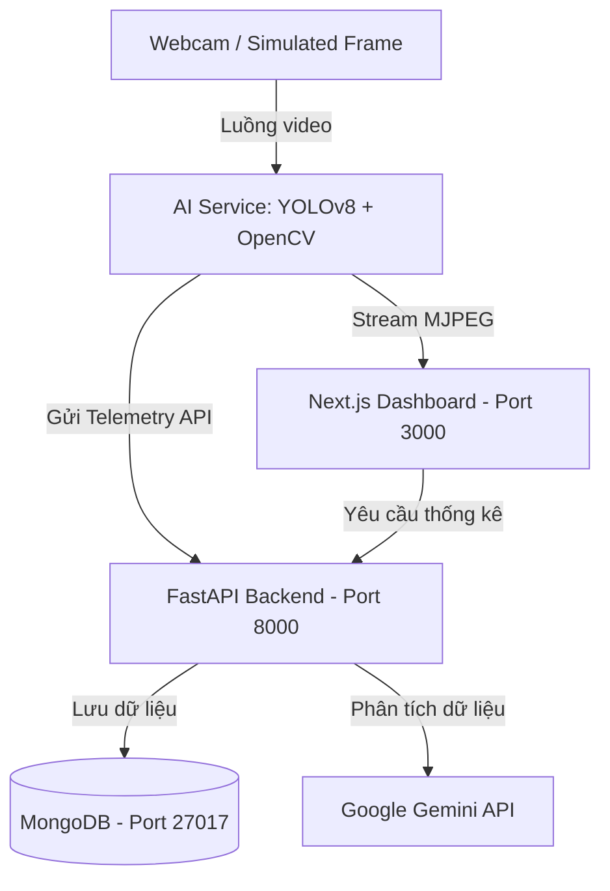

# 🏫 Edge AI Classroom Analytics (Dự án Học tập & Nghiên cứu)

<p align="center">
  
  
  
  
  
</p>

> 💡 **Lưu ý**: Đây là một dự án cá nhân được xây dựng trong quá trình tự học, tìm hiểu và thực nghiệm về **Edge AI (Trí tuệ Nhân tạo tại Biên)**, **Docker Containerization**, và ứng dụng **Computer Vision** trong quản lý lớp học. Dự án tập trung vào việc học hỏi kiến trúc hệ thống và cách tích hợp các thành phần công nghệ lại với nhau hơn là tính ứng dụng thương mại thực tế.

---

## 📖 Giới Thiệu Dự Án

Dự án này được xây dựng với mục tiêu giúp mình thực hành và làm quen với các khái niệm cốt lõi:
- **Trí tuệ nhân tạo ở biên (Edge AI)**: Cách chạy mô hình suy luận trực tiếp tại local mà không phụ thuộc vào các dịch vụ đám mây bên ngoài.
- **Kiến trúc Microservices**: Sử dụng Docker Compose để quản lý độc lập 3 dịch vụ chính (AI Service, Backend, Frontend) và 1 cơ sở dữ liệu (MongoDB).
- **Truyền tải dữ liệu thời gian thực (Real-time Telemetry)**: Cách gửi dữ liệu phân tích từ webcam về Backend thông qua HTTP API và stream trực tiếp dữ liệu hình ảnh dạng MJPEG.

---

## 🚀 Các Chức Năng Đang Tìm Hiểu & Triển Khai

* **🔍 Phát hiện và đếm người (YOLOv8)**:
  - Thử nghiệm tích hợp mô hình **YOLOv8n (Nano)** từ Ultralytics để nhận diện học sinh trong khung hình thời gian thực.
  - Ghi nhận sĩ số và đẩy lịch sử dữ liệu về backend theo chu kỳ 5 giây.

* **🧠 Phân tích trạng thái học tập (Mô phỏng)**:
  - Nghiên cứu thuật toán phân loại hành vi tập trung (**Focused**, **Neutral**, **Distracted**) dựa trên pose/head-angle của học sinh để thử nghiệm tính năng phân tích hành vi.

* **📊 Trực quan hóa dữ liệu (Dashboard)**:
  - Hiển thị luồng video xử lý trực tiếp từ AI Service bằng khung phát MJPEG.
  - Vẽ biểu đồ theo dõi biến động sĩ số và phân bố tập trung theo thời gian thực (sử dụng Recharts).

* **📝 Tạo báo cáo tự động bằng LLM (Tùy chọn)**:
  - Thử nghiệm kết nối dữ liệu từ MongoDB gửi qua **Gemini API** (`gemini-1.5-flash`) để tự động nhận xét và sinh báo cáo dạng Markdown bằng tiếng Việt.

* **⚙️ Trình giả lập lớp học (Webcam Simulation)**:
  - Do việc kết nối webcam vật lý từ máy chủ Windows/WSL2 vào Docker container khá phức tạp, dự án tích hợp sẵn bộ giả lập lớp học đồ họa 2.5D để tiện cho việc phát triển và gỡ lỗi logic hệ thống.

---

## 📐 Sơ Đồ Kiến Trúc Hệ Thống



---

## 📁 Cấu Trúc Thư Mục Dự Án

```text
├── ai-service/          # Dịch vụ chạy YOLOv8 & mô phỏng camera
├── backend/             # RESTful API bằng FastAPI kết nối MongoDB & Gemini API
├── frontend/            # Giao diện quản trị viên bằng Next.js 14
├── docker-compose.yml   # Cấu hình containerization cho toàn bộ hệ thống
└── .gitignore           # Cấu hình bỏ qua các file nhạy cảm (.env, .venv,...)
```

---

## 📦 Hướng Dẫn Chạy Thử Nghiệm

### 1️⃣ Yêu cầu hệ thống
* Đã cài đặt **Docker Desktop** trên máy tính của bạn.

### 2️⃣ Cấu hình khóa API (Tùy chọn)
Nếu muốn test thử tính năng phân tích báo cáo bằng Gemini, hãy tạo file `.env` ở thư mục gốc:
```env
GEMINI_API_KEY=khoa_api_gemini_cua_ban
```
> 💡 *Nếu không điền khóa, hệ thống sẽ tự động dùng trình giả lập để sinh báo cáo mẫu.*

### 3️⃣ Khởi chạy hệ thống
Mở Terminal tại thư mục gốc của dự án và chạy lệnh sau:
```bash
docker-compose up --build
```

Sau khi các container chạy xong, bạn có thể truy cập các địa chỉ sau:
* 🌐 **Giao diện Dashboard**: [http://localhost:3000](http://localhost:3000)
* ⚙️ **Backend API Swagger**: [http://localhost:8000/docs](http://localhost:8000/docs)
* 🏥 **Trạng thái AI Service**: [http://localhost:8001/health](http://localhost:8001/health)

---

Chúc bạn có những trải nghiệm thú vị khi tìm hiểu về **Edge AI**! 🚀
